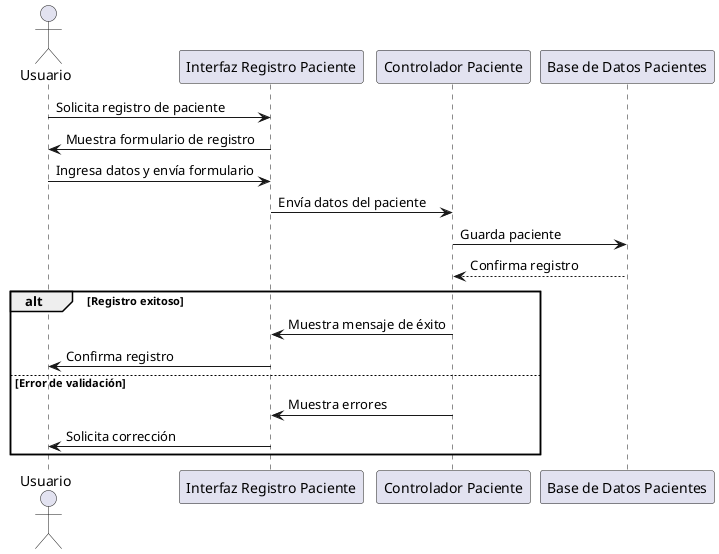

# Caso de Uso: Registrar Paciente

**Actor:** Usuario (Recepcionista, Médico, Administrador)

**Sistema:** Sistema de Historia Médica

---

## Flujo Básico

1. **El actor** accede al módulo de registro de pacientes.
    - **Actor:** Usuario
    - **Sistema:** Muestra el formulario de registro de paciente.
2. **El actor** ingresa los datos requeridos del paciente (nombre, apellidos, cédula, fecha de nacimiento, etc.).
    - **Actor:** Usuario
    - **Sistema:** Recibe los datos ingresados.
3. **El actor** presiona el botón "Registrar".
    - **Actor:** Usuario
    - **Sistema:** Valida los datos ingresados.
4. **El sistema** procesa la solicitud:
    - Si los datos son válidos, guarda el paciente y muestra mensaje de éxito.
    - Si hay errores, muestra mensajes de validación y solicita corregirlos.

---

## Interacción Actor-Sistema

| Paso | Actor  | Sistema                                      |
|------|--------|----------------------------------------------|
| 1    | Usuario| Muestra formulario de registro               |
| 2    | Usuario| Recibe datos del paciente                    |
| 3    | Usuario| Valida y procesa el registro                 |
| 4    |        | Muestra éxito o errores de validación        |

---

## Diagrama de Secuencia (PlantUML)

